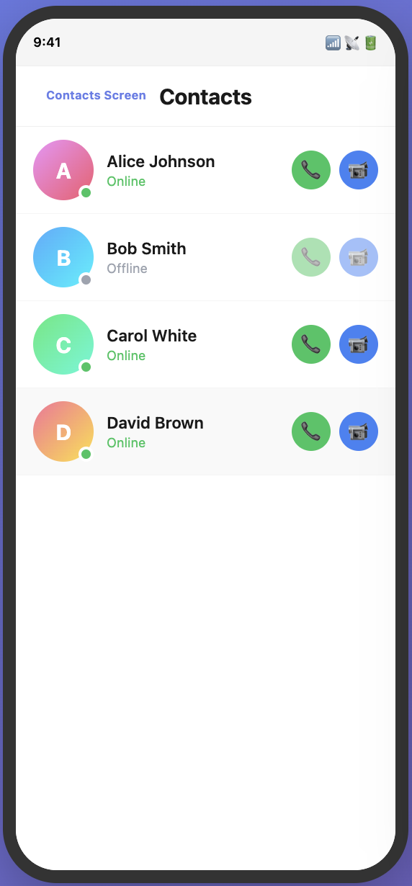
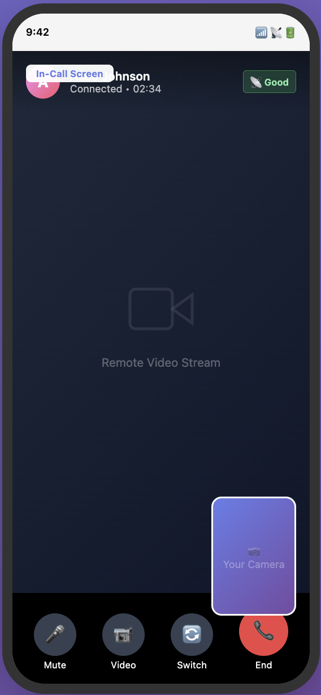

# DocTime - Professional Video Calling App

DocTime is a high-performance, production-ready video calling application built with **Flutter** and **Agora RTC SDK**. It features a modern UI, clean architecture, and reactive state management using **Riverpod**.

## 🚀 Features

- **High-Quality Video/Audio Calls**: Seamless 1-to-1 calling powered by Agora.
- **Real-time Controls**: 
  - Toggle Camera (Enable/Disable Video)
  - Mute/Unmute Microphone
  - Switch between Front and Rear Cameras
- **Modern UI/UX**:
  - Animated control overlays.
  - Floating local video preview.
  - Full-screen remote participant view.
- **Clean Architecture**: Decoupled business logic from UI using `AsyncNotifier` and Repository patterns.
- **Permission Handling**: Integrated management for Camera and Microphone access.

## 🛠️ Tech Stack

- **Framework**: [Flutter](https://flutter.dev/)
- **Real-time Communication**: [Agora RTC Engine](https://pub.dev/packages/agora_rtc_engine)
- **State Management**: [Riverpod 3.0](https://riverpod.dev/)
- **Permissions**: [Permission Handler](https://pub.dev/packages/permission_handler)

## Screenshots

<p align="center">
  
  
</p>

## Installation & Setup


### 1. Prerequisites
- Flutter SDK (v3.10.4 or higher)
- An Agora account (get your App ID at [agora.io](https://console.agora.io/))

### 2. Configuration
Create or update your configuration file (e.g., `lib/util/app_utils.dart`) with your Agora credentials:
```dart
class AppUtils {
  static const String appId = "YOUR_AGORA_APP_ID";
  static const String token = "YOUR_TEMP_TOKEN";
  static const String channelName = "test_channel";
}
```

### 3. Run the project
```bash
flutter pub get
flutter run
```

## 🏗️ Project Structure

```text
lib/
├── model/          # Data entities (CallModel, HomeModel)
├── provider/       # Riverpod providers
├── repository/     # Data sources and services
├── services/       # Agora and Permission service implementations
├── util/           # Constants and utility functions
├── view/           # UI Screens
├── viewmodel/      # Business logic (AsyncNotifiers)
└── widget/         # Reusable UI components (ControlButtons, etc.)
```

## 🛡️ Permissions

This app requires the following permissions:
- **Camera**: For video streaming.
- **Microphone**: For audio communication.

Ensure you have updated your `Info.plist` (iOS) and `AndroidManifest.xml` (Android) with the necessary privacy keys.

## 🤝 Contributing

Contributions are welcome! Please feel free to submit a Pull Request.

1. Fork the Project
2. Create your Feature Branch (`git checkout -b feature/AmazingFeature`)
3. Commit your Changes (`git commit -m 'Add some AmazingFeature'`)
4. Push to the Branch (`git push origin feature/AmazingFeature`)
5. Open a Pull Request

## 📄 License

Distributed under the MIT License.

---
Built with ❤️ by [Your Name/GitHub Handle]
